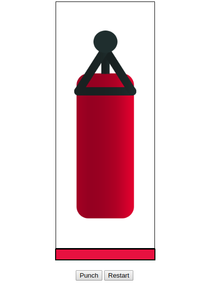
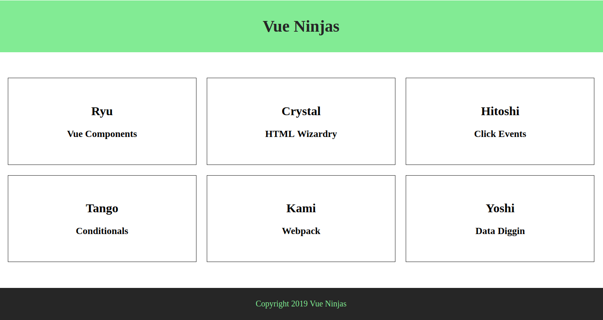

## learn vue lesson


### [`lesson1 start`](https://github.com/caucoder/learn-vue/tree/lesson1)


1. app.js 也就是声明Vue对象的代码需要在使用的div后面声明，不能在前面.
2. vue对象挂载在对应的div


### [`lesson2 methods`](https://github.com/caucoder/learn-vue/tree/lesson2)


1. vue定义方法methods，在方法中访问data通过this
2. 在html中访问方法


### [`lesson3 data binding`](https://github.com/caucoder/learn-vue/tree/lesson3)


1. v-bind: 也可以是 : ,讲vue对象的数据与标签属性绑定
2. v-html: 将字符串转化为html
3. 数据的key需要用双引号，而不是单引号
4. 在props时也使用

### [`lesson4 events`](https://github.com/caucoder/learn-vue/tree/lesson4)

1. v-on: 常用事件click,dblclick,mousemove
2. html通过vue事件调用方法
3. 通过方法改变vue对象数据，然后在html中实时显示
4. 事件方法，有参数则传递参数，没有则不用写括号
5. 在浏览器中开发者模式中观察console.log输出的信息，event


### [`lesson5 events modifiers`](https://github.com/caucoder/learn-vue/tree/lesson5)

1. v-on:click.once 只允许点击一次生效
2. v-on:click.prevent 如：链接，通过点击，阻止访问


### [`lesson6 keyboard events`](https://github.com/caucoder/learn-vue/tree/lesson6)

1. keyup.enter
2. keyup.alt.enter alt键与enter键结合

### [`lesson7 Two-way data binding`](https://github.com/caucoder/learn-vue/tree/lesson7)


1. v-model='name' 将html的数据，如input的内容绑定到vue对象中

### [`lesson8 computed properties`](https://github.com/caucoder/learn-vue/tree/lesson8)

1. v-on:click="a++"
2. 与methods的区别，computed更加高效，只调用vue中数据发生改变的方法
3. html中调用不需要括号

### [`lesson9 dynamic css class`](https://github.com/caucoder/learn-vue/tree/lesson9)


1. v-bind语法决定标签是否使用css样式
    ```html
    <div v-bind:class="{red: false}"></div>
    ```
2. css文件定义了class（.available）的样式,在html中 v-bind:class="{available: available}",而vue可以通过控制第二个available的值
3. 通过computed的形式进行设置

### [`lesson10 conditions`](https://github.com/caucoder/learn-vue/tree/lesson10)

1. v-if,v-else-if,决定是否显示该标签
2. v-show 与v-if不同在于，在page source里面，不显示是通过css样式控制，而v-if是直接没有该代码
    ```html
    <p style="display: none;">Whooo,succuss :) </p>
    ```


### [`lesson11 looping with v-for`](https://github.com/caucoder/learn-vue/tree/lesson11)

1. v-for,循环该标签
    ```html
    <li v-for="character in characters"> {{character}}</li>
    ```
2. 遍历对象list,以及遍历对象所有属性
3. 遍历时带上index
    ```html
    v-for="(ninja,index) in ninjas"
    ```
4. template标签在html中不会显示
    ```html
    <template v-for="ninja in ninjas">
        <div v-for="(val, key) in ninja">
            <p>{{key}} - {{ val }}</p>
        </div>
        <hr />
    </template>
    ```
5. 为防止插件报错
    ```html
    <li v-for="character in characters" v-bind:key="character"> {{character}}</li>
    ```


----------


### [`lesson12 小项目-Punchbag Game`](https://github.com/caucoder/learn-vue/tree/lesson12)



1. 做一个小项目巩固前面所学到的知识
2. vue控制css显示都是听过true方式，html中图片处理也交给css
    ```html
    <div id="bag" v-bind:class="{burst: end}">
    ```
3. 犯错
    1. 在vue对象的方法中访问数据，一定要记得加上this


----------

### [`lesson13 Multiple Vue Instances`](https://github.com/caucoder/learn-vue/tree/lesson13)

1. vue对象对应一个绑定的div,vue对象可以访问另外一个vue对象


### [`lesson14 Intro to Components`](https://github.com/caucoder/learn-vue/tree/lesson14)

1. 复用，template中访问数据，data定义是一个function
    ```javascript
    Vue.component("greeting", {
        template: "<p>Hey {{name}}, I am a re-usable component. <button v-on:click='changeName'>change name</button></p>",
        // data是function,每次返回一个新对象一遍template互不影响 
        data: function(){ 
            return{
                name: 'Q10Viking'
            }
        },
        methods: {
            changeName: function(){
                this.name = "huangzhuangzhuang"
            }
        }
    });
    ```
2. html中使用
    ```html
    <greeting></greeting>
    ```


### [`lesson15 Refs`](https://github.com/caucoder/learn-vue/tree/lesson15)

1. vue通过**this.$refs**引用html中标有**ref**的标签，我们通过console.log(this.$refs)打印的内容找到我们需要的信息
```javascript
//vue部分代码
submit: function(){
    // console.log(this.$refs.inputRef.value);
    this.food = this.$refs.inputRef.value;
    console.log(this.$refs.divRef.innerText);
}  
//html中input部分代码
 <input type="text" ref="inputRef" v-bind:placeholder="prompt">
```


### [`lesson16 vue-cli`](https://github.com/caucoder/learn-vue/tree/lesson16)

1. 使用vue-cli创建项目,cli(command line interface)
    ```bash
    vue create my-project
    npm run serve
    ```

### [`lesson17 Vue Files & The Root Component`](https://github.com/caucoder/learn-vue/tree/lesson17)

1. 创建第一个vue-cli项目，并输出hello world
2. 与之前相比，index.html中没有对main.js的显示声明使用.
3. main.js的vue对象是通过vue文件render而成的。


### [`lesson18 Nesting components`](https://github.com/caucoder/learn-vue/tree/lesson18)

1. App.vue is the root component
2. component注册global全局方式，在main.js文件中
    ```javascript
    // 全局注册组件
    
    import language from './components/language.vue'
    Vue.component('language',language);
    
    ```
3. component注册local局部方式，如在App.vue中使用
    ```javascript
        <script>
        import language from './components/language.vue'
        export default {
        components:{
            'language': language
        },
        //...
        }
        </script>
    ```
4. 组件注册，然后使用


### [`lesson19 components css`](https://github.com/caucoder/learn-vue/tree/lesson19)

1. 将对应的css样式只使用在对应的vue template模板组件上，使用scoped（会在生成html代码时给标签加上属性值在css中对应）
    ```html
    <style scoped>
    h1{
    color: green;
    }
    </style>
    ```


### [`lesson20 小项目-Nesting Components Examples`](https://github.com/caucoder/learn-vue/tree/lesson20)



1. App.vue是root component,其他的Header,Ninjas,Footer组件，构成页面


----------


### [`lesson21 props`](https://github.com/caucoder/learn-vue/tree/lesson21)

1. 组件属性，用于传递数据.组件只负责操作数据就好，如Ninjas.vue
2. 组件的属性可以当做是data
3. v-bind将传递的属性为数据绑定，而不是字符串
    ```javascript
    export default {
    props: ['ninjas'],
    data(){
        return {
        }
    }
    }
    ```
4. props校验
    ```javascript
    props: {
        ninjas:{
            type: Array,
            required: true
        }
    }
    ```


### [`lesson22 primitive vs refer type`](https://github.com/caucoder/learn-vue/tree/lesson22)

1. 原始数据类型与引用数据在template组件中的区别：
    1. 原始数据类型不会影响不同template
    2. 引用在template中会影响，因为数据都是来自同一个数据源


### [`lesson23 primitive event`](https://github.com/caucoder/learn-vue/tree/lesson23)

1. 局部的template改变原始数据类型，同步到parent的原始数据中。如改变Header.vue的title,直接影响到App.vue
2. 局部的template方法： 
    ```javascript
    this.$emit("changeTitle","Q10Viking learning vue");
    ```
3. parent App.vue中监听该方法,注意传递的参数需要有$符号
    ```javascript
    <app-header v-bind:title="title" v-on:changeTitle="updateTitle($event)"></app-header>
    ```


### [`lesson24 event bus`](https://github.com/caucoder/learn-vue/tree/lesson24)

1. template局部数据传递不经过root,Header.vue的title改变直接通过bus vue对象传到了Footer.vue,而不需要经过App.vue
2. bus 需要 export const bus = new Vue(); 使用 import { bus } from 'somewhere';
3. bus绑定方法与数据 bus.$emit("functionname","data"); 
4. bus使用需要定义在created中，使用bus.$on监听
    ```javascript
    created(){
        bus.$on("titleChanged",(data)=>{
        this.title = data;
        });
    }
    ```


### [`lesson25 life cycle`](https://github.com/caucoder/learn-vue/tree/lesson25)


1. 基本了解life cycle,其中对应的function都可以在vue中定义，以便我们进行操作。
2. mount是挂载到DOM中，在浏览器中显示


### [`lesson26 slot`](https://github.com/caucoder/learn-vue/tree/lesson26)

1. 能够在组件中插入html代码，如： 在formHelper.vue中我们定义了form表单的基本骨骼，具体的内容以通过slot来进行填充
    ```html
    <!-- 要插入的slot -->
    <div slot="name"></div>
    <!-- 使用slot -->
    <slot name="name"></slot>
    ```


### [`lesson27 dynamic components`](https://github.com/caucoder/learn-vue/tree/lesson27)

1. 动态转化组件，在App.vue中，通过点击按钮，切换到不同的组件。
2. component标签来进行维护一个组件变量，其中属性为is
    ```html
    <component v-bind:is="component"> </component>
    ```
3. maintain data,也就是在动态切换component中，该组件的vue对象不被销毁,keep-alive标签
    ```html
    <keep-alive>
        <component v-bind:is="component"> </component>
    </keep-alive>
    ```


### [`lesson28 Input binding(create a blog-part1)`](https://github.com/caucoder/learn-vue/tree/lesson28)

1. v-model.lazy,vue对象数据延迟显示，如input,在输入的时候只有回车，preview区域才显示。
2. data 返回的是对象blog，访问属性是blog.title


### [`lesson29 checkbox binding`](https://github.com/caucoder/learn-vue/tree/lesson29)

1. checkbox中的value 数据存储到 数组当中

### [`lesson30 select box binding`](https://github.com/caucoder/learn-vue/tree/lesson30)

1. select的value等于选的option，在这里option没有设置value,但是选择了它value就添加到select中了，value默认为遍历的author
```html
<select v-model="blog.author">
    <option v-for="author in authors" v-bind:key="author">{{author}}</option>
</select>
```

### [`lesson31 http requests post`](https://github.com/caucoder/learn-vue/tree/lesson31)

1.  安装一个插件[vue-resources](https://github.com/pagekit/vue-resource)
2. 在main.js需要声明Vue对象使用该插件
    ```javascript
    import VueResource from 'vue-resource'
    Vue.use(VueResource);
    ```
3. json数据提交测试地址[JsonPlaceHolder](http://jsonplaceholder.typicode.com/)
4. 发送http-post请求
    ```javascript
    this.$http.post('http://jsonplaceholder.typicode.com/posts', {
                    title: this.blog.title,
                    body: this.blog.content,
                    userId: 1
                })
    ```

### [`lesson32 http requests get`](https://github.com/caucoder/learn-vue/tree/lesson32)


1. get请求获取post文章，然后显示出来


### [`lesson33 custom driver`](https://github.com/caucoder/learn-vue/tree/lesson33)

> 自定义v-指示

1. 全局定义，在main.js中定义全局的directive，使用bind方法，其中三个参数
    ```javascript
    //Custom directives
    Vue.directive("rainbow",{
    bind(el,binding,vnode){
        el.style.color="#" + Math.random().toString().slice(2,8);
        //el.style.color="red";
    }
    });


    Vue.directive("theme",{
    bind(el,binding,vnode){
        //value
        if(binding.value == "wide"){
        el.style.maxWidth = "1200px";
        }else if(binding.value == "narrow"){
        el.style.maxWidth = "560px";
        }
        //arg
        if(binding.arg == "column"){
        el.style.background = "#ddd";
        el.style.padding = "20px"; 
        }
    }
    });
    ```
2. bind方法中el，代表那个标签，可以设置css，style属性
3. bind方法中的binding，代表传递的参数，如value,arg
```html
 <!-- 注意字符串需要在双引号中用单引号 -->
 <!-- narow是value,column是arg -->
 <div v-theme:column="'narrow'">
```


### [`lesson34 filters`](https://github.com/caucoder/learn-vue/tree/lesson34)


1. 过滤器，对内容进一步加工处理。
2. 在main.js中声明自定义的过滤器。
    ```javascript
        //filter
        Vue.filter("to-uppercase",function(value){
        return value.toUpperCase();
        });


        Vue.filter("snippet",function(data){
        return data.slice(0,100)+"... ..."
        })
    ```
3. 在showBlogs.vue中使用，过滤器
    ```javascript
        <h2>{{ blog.title | to-uppercase }}</h2>
        <article>{{ blog.body | snippet }}</article>
    ```


### [`lesson35 custom Search Filter`](https://github.com/caucoder/learn-vue/tree/lesson35)


> 自定义搜索过滤器

1. 使用computed属性，通过绑定search内容，实时过滤，然后再遍历显示。
    ```javascript
    computed:{
        filterBlogs: function(){
            //数据过滤器带有filter
            return this.blogs.filter((blog)=>{
                //return false or true
                return blog.title.match(this.search);
            })
        }
    }
    ```
    ```javascript
        v-for="blog in filterBlogs"
    ```

### [`lesson36 Registering Things Locally`](https://github.com/caucoder/learn-vue/tree/lesson36)

1. 在showBlogs.vue中声明过滤器，directive等
    ```javascript
        filters:{
            toUppercase(value){
                return value.toUpperCase();
            }
        },
        directives:{
            "rainbow": {
                bind(el,binding,vnode){
                    el.style.color = "#"+Math.random().toString(16).slice(2,6);
                }
            }
        }
    ```

### [`lesson37 Mixins`](https://github.com/caucoder/learn-vue/tree/lesson37)

1. mixins属性，将computed方法独立出来放在searchMixin.js文件中，在showBlog.vue,showTitle.vue中都可以使用
    ```javascript
    export default {
        computed: {
            filterBlogs: function(){
                return this.blogs.filter((blog) => {
                    return blog.title.match(this.search);
                });
            }
        }
    };
    ```
2. 使用
    ```javascript
    //首先导入
    import searchMixin from '../mixins/searchMixin';
    //声明
    mixins: [searchMixin]
    ```

### [`lesson38 Setting up Routing`](https://github.com/caucoder/learn-vue/tree/lesson38)

1. 安装vue-router
    ```
    npm install vue-router --save
    ```
2. 在main.js中声明使用
    ```
        import VueRouter from 'vue-router'
        Vue.use(VueRouter);
        const router = new VueRouter({
        routes: routes
        });
    ```
3. 在vue中注册该router
    ```
        new Vue({
            render: h => h(App),
            router: router
        }).$mount('#app')
    ```
4. 在App.vue中声明使用router-view标签
    ```
        <router-view></router-view>
    ```
    > 以后在访问的时候会多出一个#符号，如 http://localhost:8080/#/


### [`lesson39 Adding Router Links`](https://github.com/caucoder/learn-vue/tree/lesson39)

1. 添加vue-route链接，在header.vue中添加导航nav
    ```
        <router-link to="/" exact>Blog</router-link>
    ```
2. **exact**表示route链接只激活一个，通过浏览器开发者模式，设置css样式


### [`lesson40 Route Parameters`](https://github.com/caucoder/learn-vue/tree/lesson40)

> route到vue组件，该vue组件通过自动调用created方法，我们在其中请求后台。表面是请求http://localhost:8080/#/blog/10，实际上是 http://jsonplaceholder.typicode.com/posts/10

1. 在route.js中设置路由,注意不要省略冒号
    ```javascript
        {path: "/blog/:id",component: singleBlog}
    ```
2. 提取请求的参数
    ```javascript
        id: this.$route.params.id
    ```
3. 向后台发送请求，带上id参数
    ```javascript
        // http://localhost:8080/#/blog/10
        this.$http.get('http://jsonplaceholder.typicode.com/posts/'+this.id).then(function(data){
            console.log(data);
            this.blog = data.body;
        });
    ```


## Import Notes

1. html-> vue 改变vue的数据
    1. event方法（调用方法，或者直接改变data）
    2. v-model,v-model.lazy
    3. ref
2. vue->html,html渲染数据
    1. v-bind


## Css样式

1. css样式中div，区块居中
    ```css
        /* 居中 */
        margin: 40px auto;
    ```

2. 方块，样式 [`lesson20`](https://github.com/caucoder/learn-vue/tree/lesson20)
    ```css
    ul{
        display: flex;
        flex-wrap: wrap;
        list-style-type: none;
        padding: 0;
    }

    li{
        flex-grow: 1;
        flex-basis: 300px;
        text-align: center;
        padding: 30px;
        border: 1px solid #222;
        margin: 10px;
    }
    ```

3. ul,li样式
    ```css
    /* 去掉小黑点 */
    #useful-links ul{
        padding: 0;
    }
    /* li排列方式 */
    #useful-links li{
        display: inline-block;
        margin-right: 10px;
    }
    ```

4. 显示为一行一个区块
    ```css
    display: block;
    ```


----------


## vscode插件

1. Live Server
2. VueHelper

